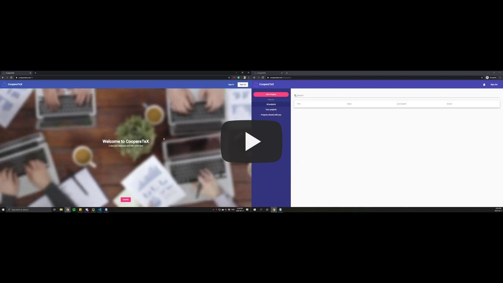

  

<h1 align="center">
  <a href="https://cooperatex.me">CooperaTeX</a>
</h1>

> A web app to collaborate with other users and edit LaTeX documents (featuring real-time compilation, templates and more).

<h2>Table of Contents</h2>

- [Demo](#demo)
- [Features](#features)
- [Documentation](#documentation)
- [Contributors](#contributors)
- [License](#license)

## Demo

## Features

- Automatically compiles LaTeX documents into PDFs as you edit.
- Collaborate and edit LaTeX documents in real-time.
- Share projects with any amount of users.
- Choose between a range of different starting templates.

## Documentation

Documentation for the REST API as well as the WebSocket API.

[**Documentation URL**](docs)

## Contributors

This project was made in collaboration with [Thomas Lo](https://github.com/tommy-lo)

## License

[MIT](./LICENSE) &copy; [Pravinthan Prabagaran](https://pravinthan.com).

[MIT](./LICENSE) &copy; [Thomas Lo](https://github.com/tommy-lo).
